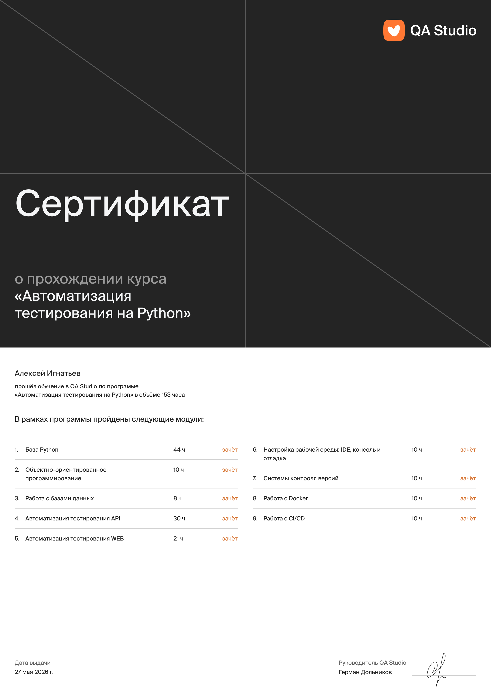
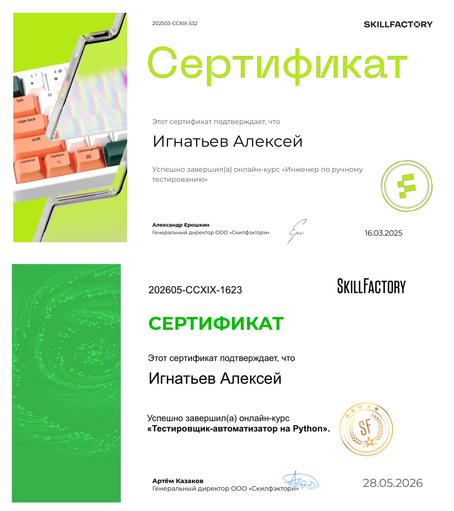

## Всем привет, я Алексей 👋
##### QA Engineer (Auto-focused) 🧡

* 🔥 Год в тестировании
* 🐍 Пишу автотесты на Python
* ⚙️ Развиваюсь в автоматизации
* 📞 Мои контакты: **[телеграм](https://t.me/AlexOfDreams)**, **[почта](rabotnik.it94@mail.ru)**

[//]: # (* 📑 Опыт и навыки в **[резюме]&#40;https://career.habr.com/companies/qa-studio&#41;**)

 

### Python QA Auto 🛠️ Мой стек:

## Тестирование API и интеграций

  &nbsp
  &nbsp
  &nbsp
  &nbsp
  &nbsp
  &nbsp

## Тестирование Web

  &nbsp
  &nbsp
  &nbsp
  &nbsp

## Логи и мониторинги

  &nbsp
  &nbsp
  &nbsp

## Тестовая документация 
  

    &nbsp
    &nbsp
    &nbsp
  

## Работа с базами данных

  &nbsp
  &nbsp
  &nbsp

## Автотесты

  &nbsp
  &nbsp
  &nbsp
  &nbsp
  &nbsp
  &nbsp
  &nbsp

#### Мои проекты:
| API My Shows Rating |  API Битва покемонов | UI Битва покемонов |
|---------------------|----------------------|--------------------|
|[my-shows-api-tests](https://github.com/I-Alex-it/myshows_api_tests)|[pokemonbattle-api-tests](https://github.com/I-Alex-it/pokemonbattle_api_tests)   | [pokemonbattle-e2e-tests](https://github.com/I-Alex-it/pokemonbattle_e2e_tests)
| Pytest, Requests, Docker|Pytest, Requests, Gitlab CI| Selenium, Gitlab CI|

### 📚 Обучение
|  | 
